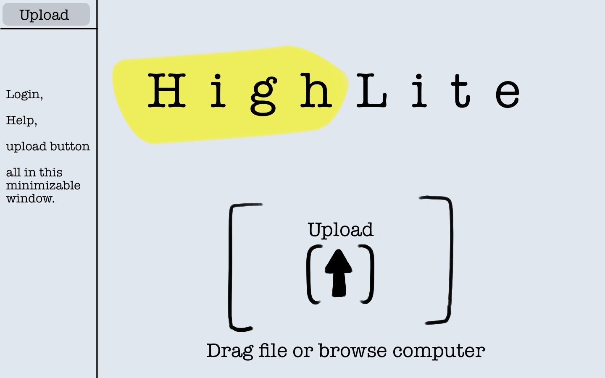
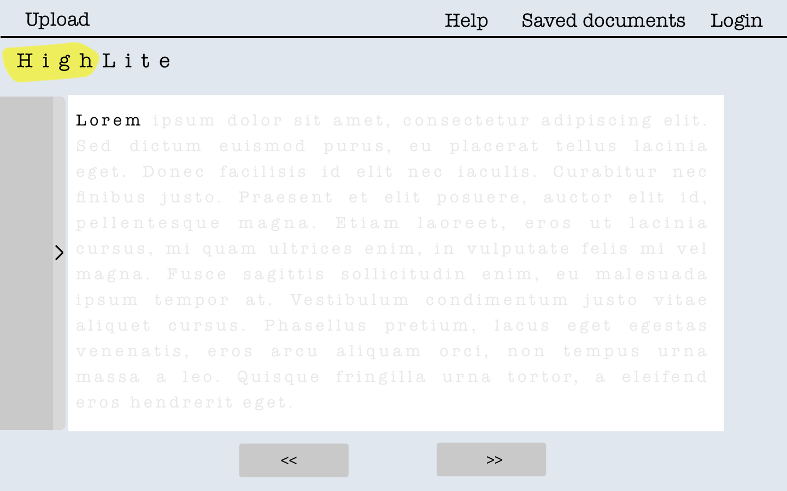
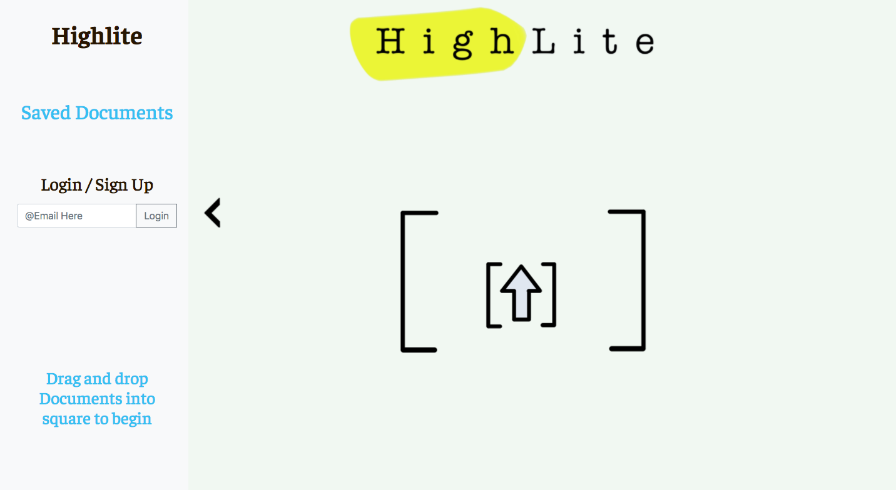
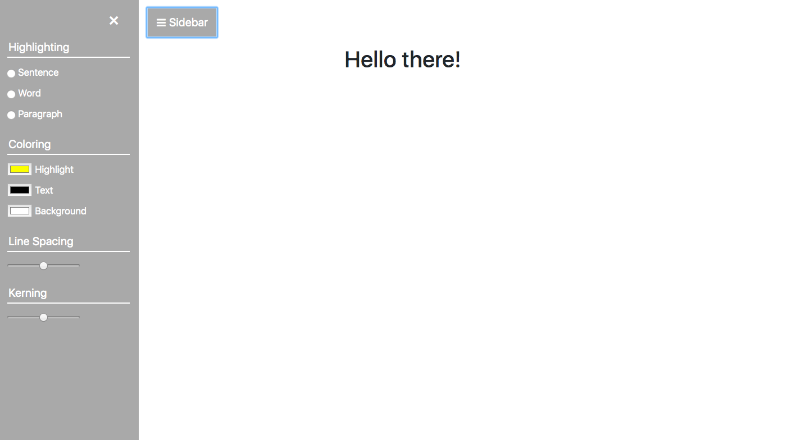

# Team name:
* Team Zeta

# Team overview:
* Benjamin Hillard, Github "benjihillard"
* Corey Sarkis, Github "csarkis7"
* Alden Burgess, Github "aldenburgess"

# Our idea:
Highlite is a web tool that aims to assist those who have trouble reading due to Dyslexia, ADHD, and other cognitive disabilities. Highlite takes in a range of input texts from PDFs and Docx files to Epubs and copy+pasted text. The software creates an interactive page where the user can adjust the format of the text to the readability that best suits them. This includes changing the font to dyslexic friendly styles and colors, as well changing backgrounds to optimize text contrast. Highlite is a distraction free page that allows the user to blackout text by paragraph, line and even word by word. Users can toggle off these blackouts at their own rate via keystrokes or on a timer if they are feeling competitive. Highlite ensures maximum readability of documents, even if it has to be read one word at a time.

# Important data:
Server:
After being parsed the server will return a JSON object containing three strings to the client (easyread.js). Each of the strings will be the one continuous string of the text from the uploads text files just parsed in different ways.
The JSON object will include:
* Word: a string of the text parsed word by word
* Sentance: a string of the text parsed sentence by sentence
* Paragraph: a string of the text parsed paragraph by paragraph

Frontpage.js:
The most important data is the in uploaded text files. The text files will be sent from the client (frontPage.js) to the server for parsings.
The front page also hold an user email variable:
* Username: a string representing the username of a returning user or brand new user.
The user name is sent to the server then to the database to check for user data or make a new account.
If the user has an account a JSON object is sent from the database holding all the users preference.  

easyRead.js:
The easyRead page will collect several variables from the user such as:
* fontStyle: the users preferred font.
* background Color: the users preferred page background color
* textColor: users preferred text color 
* highliteColor: the color the user prefers the text to be blocked out with
* lineSpacing: a float representing the distance between lines of text
* Kerning: a float representing the distance between words

These variables will be used to make the page as readable as possible for the user.

DataBase:
The database holds user objects. Which are JSON object holding all the variables from easyRead.js tagged to a user name from Frontpage.js. 

# Division of labor:
* Benjamin: Responsible for HTML/CSS on upload page, as well as early upload implementation (WIP)
* Corey: Responsible for HTML/CSS on read page
* Alden: Responsible for final pass CSS/HTML edits, wireframes and visual design, and writeup.

# User interface:
* wireframes:

The above are the first-pass wireframes/design mockups we used to inform our CSS/HTML mockups. Our website has two main pages the user interacts with, so we wireframed both.

* html/css mockups:

The above are our current working mockups of the read and upload pages. Each page features minimalist, distraction free design, with minimizable sidebar menus. The upload page features a working upload field, and the read page has a sidebar for formatting options along with a large space for the uploaded text to be pasted where these formatting options will be applied.
