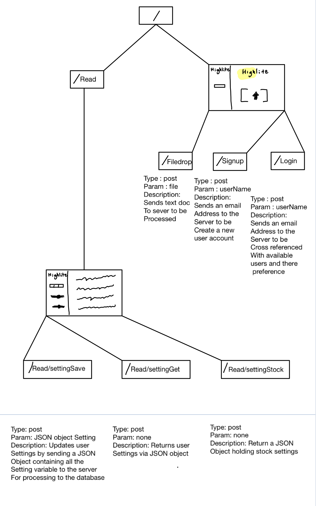
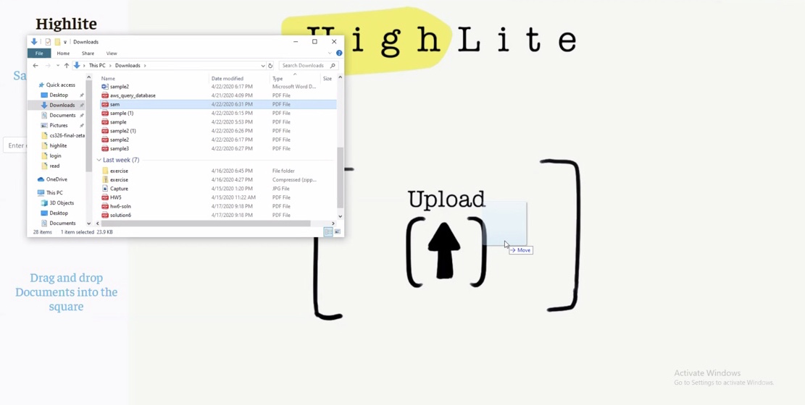
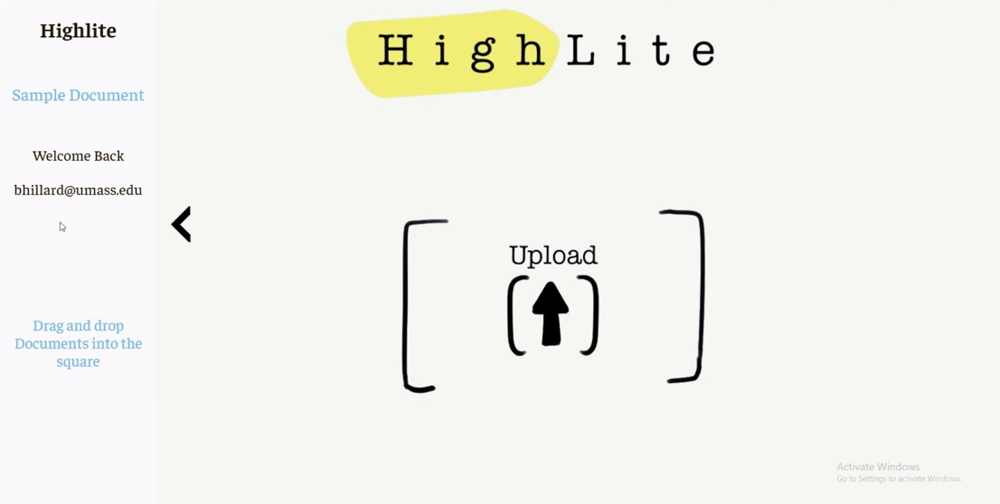
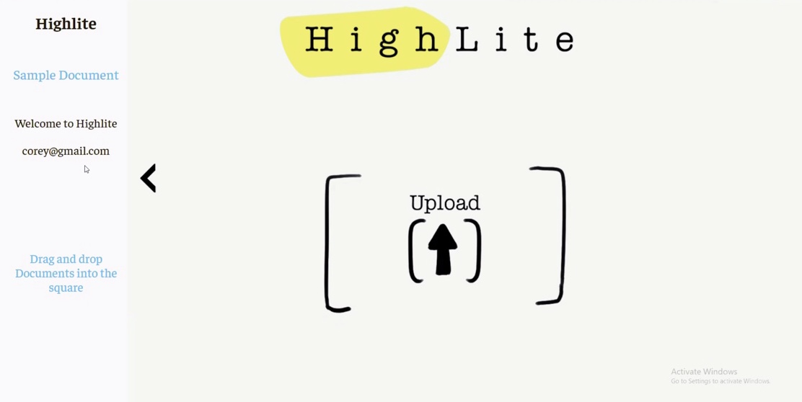
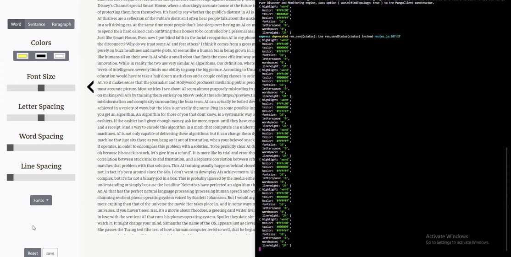
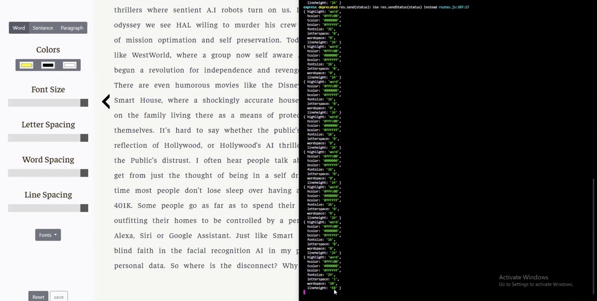
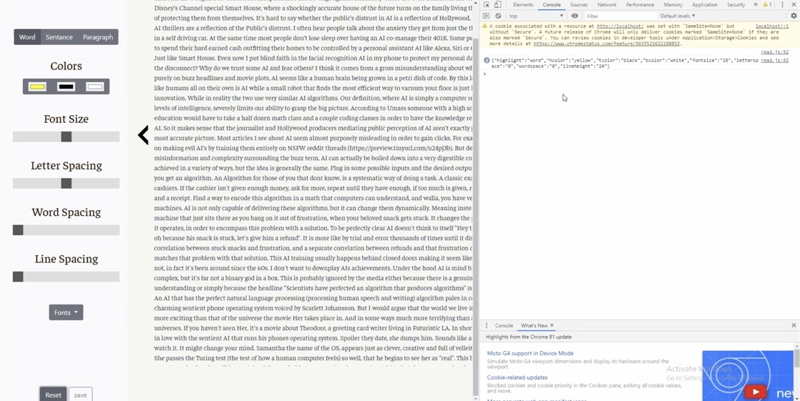

# Milestone 2

# Screenshots

This screenshot shows the ability to drag and drop a file.

This screenshot shows a user logging into their account on the website.

This screenshot shows a user creating an account on the website.

This screenshot shows the settings, which happen to be the default settings, being sent to the database when the save button is pressed.

This screenshot shows the settings being updated and sent to the database. This can be seen in the console as the latest set of settings have been changed.

This screenshot shows the settings being reset and the default settings have been received from the server. This can be seen in the console as the settings that have been received are the default settings.

# Heroku Link:
* Login page: https://highlite-test.herokuapp.com
* Read page: https://highlite-test.herokuapp.com/read/index.html
Benji is currently figuring out how to redirect the user to the read page once a file upload is detected. For now, there's no clean way to transition between pages.

# Contributions
Benji Hillard:
* Login API
* Signup API
* Filedrop API
* SettingStock API
* Updated login page JS and HTML
* Spanify JS module for parsing PDF

Corey Sarkis:
* Updated read page HTML: Sidebar setting options
* Updated read page JavaScript: storeSettings functionality
* Updated read page JavaScript: Alter displayed text based on settings
* Implemented settingsSave API: Send saved settings to server

Alden Burgess:
* Updated read page Javascript: cycling span highlighting functionality
* Updated read page Javascript: place spans around words or sentences depending on user preferences
* Improved JS/HTML integration
* Implemented settingsGet API for retrieving JSON from the server
* Heroku integration and deployment
